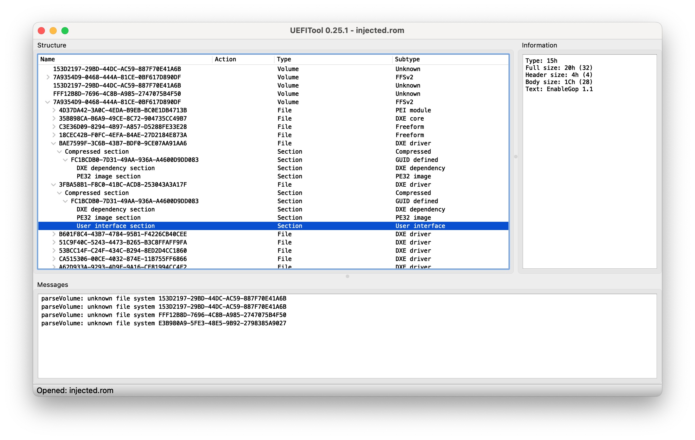

# Provides standalone GOP driver for classic Mac Pro

## Status
**Current status: Early beta release.** This has been tested and is working on at least some machines
however, in the worst case (but quite possible) scenario, an incompatible or incorrectly installed driver
in firmware may brick your Mac Pro. Unless you own a Matt Card, or can desolder and reprogram your own
NVRAM chip, you are strongly recommended to wait for further testing by users who do possess these.

## Summary
Targetting 144.0.0.0.0 firmware, this driver gathers and injects the parts of the OpenCore `UEFI/Output`
section needed for graphics support on non-natively supported GPUs on the Mac Pro. It should enable the
native boot picker, firmware password, macOS boot progress screen, etc.

For GPUs needing `DirectGopRendering` in OpenCore use `EnableGopDirect.efi`, otherwise use `EnableGop.efi`
as it renders faster on most other systems.

## Usage

## Test install as Driver#### entry

`EnableGop.efi` and `EnableGopDirect.efi` may be tested by installing as `Driver####` entries from UEFI Shell,
e.g. `bcfg driver add 0 EnableGop.efi "EnableGop"`.

Worst case scenario with this method, if you cannot recover with `CMD+OPT+P+R`, you need to extract the hard
drive on which `EnableGop.efi` resides and delete just that file, `Driver####` entries referring to non-existent
files are simply skipped.

_Note_: Linux `efibootmgr` cannot be used, since it does not create driver entries which work with Mac Pro
firmware.

## Live install to firmware

The `.ffs` files provided in this directory can be manually added to the firmware using `UEFITool`,
or automatically added using @dosdude's `DXEInject`. If you are not familiar with these procedures,
you are recommended to proceed with extreme caution.

The `.ffs` file may be inserted anywhere within the fifth and final `7A9354D9-0468-444A-81CE-0BF617D890DF`
(`EfiFirmwareFileSystemGuid`) volume of the 144.0.0.0.0 firmware. You might try immediately after the final
firmware file in the volume, which has GUID `7EC21E57-CE8A-4FDE-B147-0F7C0959CD3F`. (`DXEInject` inserts it
earlier in the same volume, which is also fine.)

So, in one go: in UEFITool 0.25.1 (it must be that old version, not the newer `_NE` or new engine versions, which
cannot yet edit) perform a GUID search for `7EC21E57-CE8A-4FDE-B147-0F7C0959CD3F`; double-click on the search
result; right-click on the DXE driver with that GUID which should then appear; choose "Insert after..." and
select `EnableGop.ffs`; save the modified firmware.

The end result, after saving and re-loading, should look like this:

*Note*: Worst case scenario with this procedure, your Mac Pro is permanently bricked unless you possess a clean
ROM image and either a Matt card or the ability to desolder and reprogram your own NVRAM chip.
